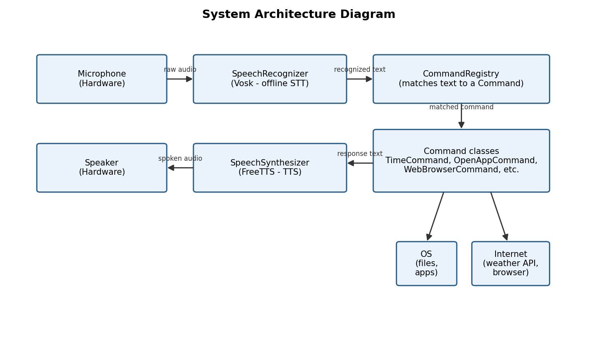
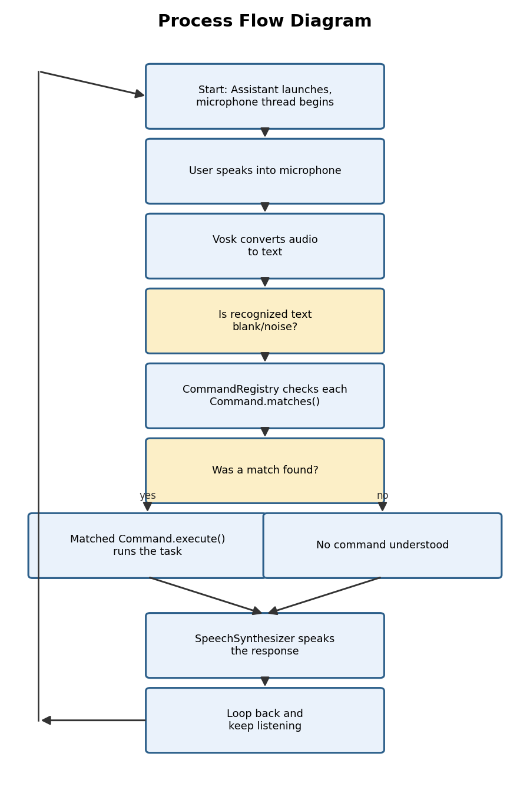
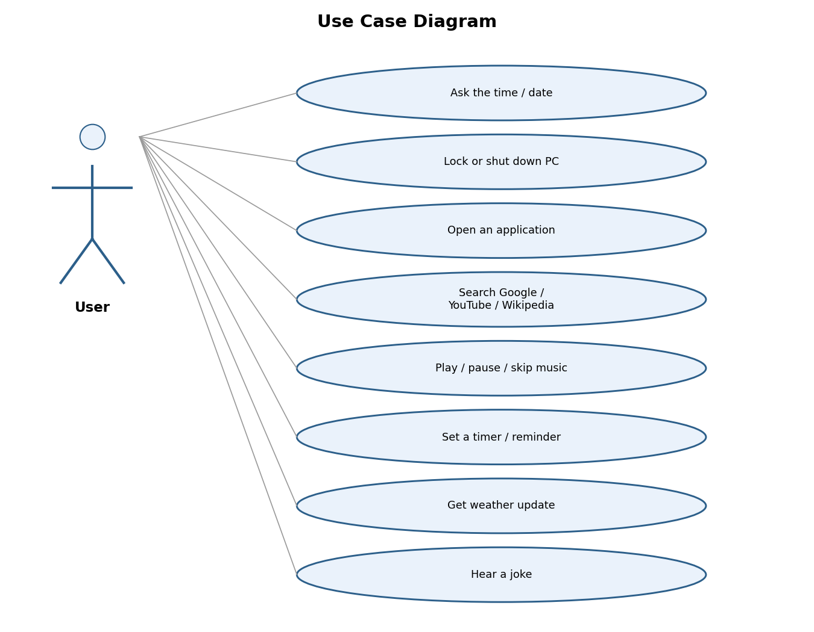
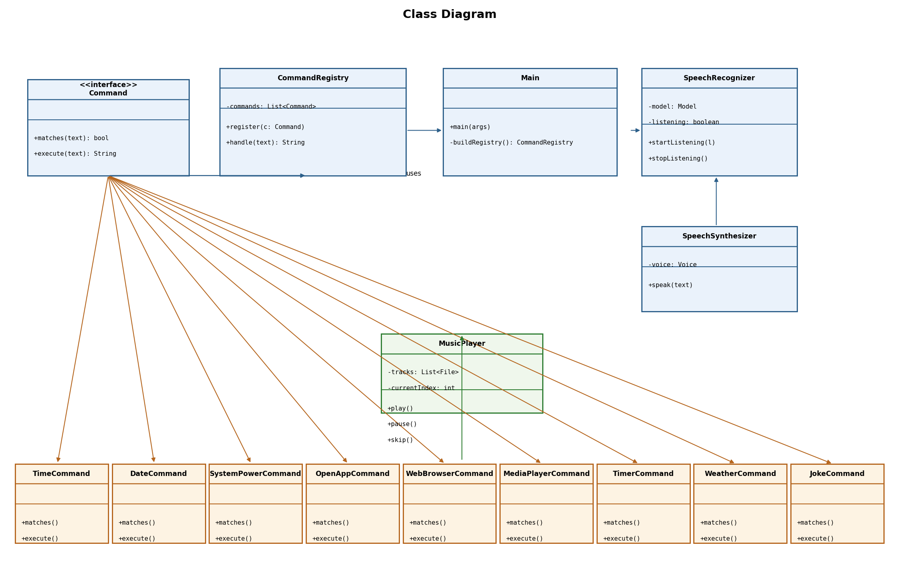
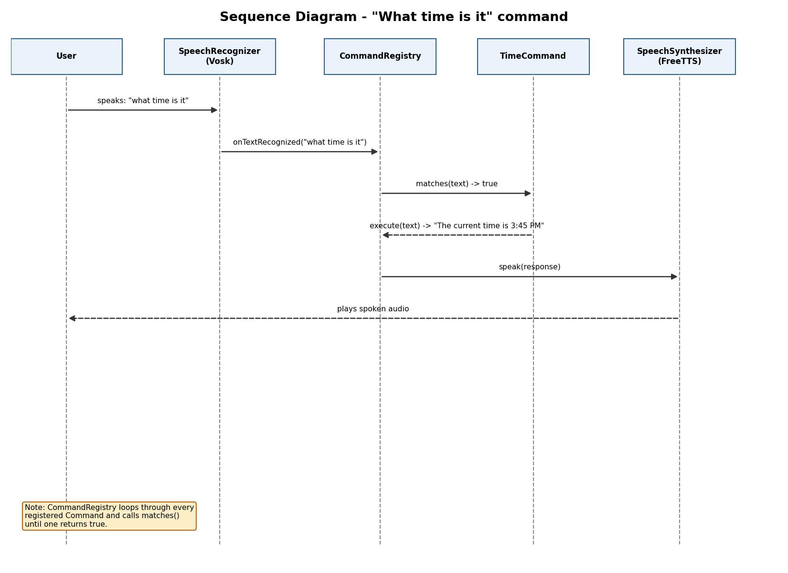

# Design Diagrams

## System Architecture Diagram
Shows the major components and how data flows between them.

## Process Flow / Workflow Diagram
Shows the step-by-step logic the program follows from startup to speaking a response.

## Use Case Diagram
Shows every action the user can trigger by voice.

## Class Diagram
Shows how the classes relate: `Command` is an interface, every task (`TimeCommand`,
`OpenAppCommand`, etc.) implements it, `CommandRegistry` holds and dispatches them,
and `Main` wires everything together.

## Sequence Diagram
Walks through exactly what happens for one example command ("what time is it"),
from the microphone picking up sound to the assistant speaking back.

## ER Diagram / Database Schema
**Not applicable.** This project does not use a database or any persistent storage -
all data (recognized text, command results) exists only in memory while the program
runs, and mp3 files are simply read from a folder on disk.
